# System Analyzer

A GTK4 / Libadwaita system diagnostics and resource monitoring application
for Linux, with deep per-process tracing powered by eBPF: memory leak
detection, I/O activity, scheduling latency, lock contention, CPU flame
graphs, syscall anomaly detection, RAPL power estimation, and a ransomware
behavior canary — all in a native, privilege-separated desktop app.

This repository distributes **only the installable `.deb` package**.
There is no source code here — grab the package from the
[Releases](../../releases) page.

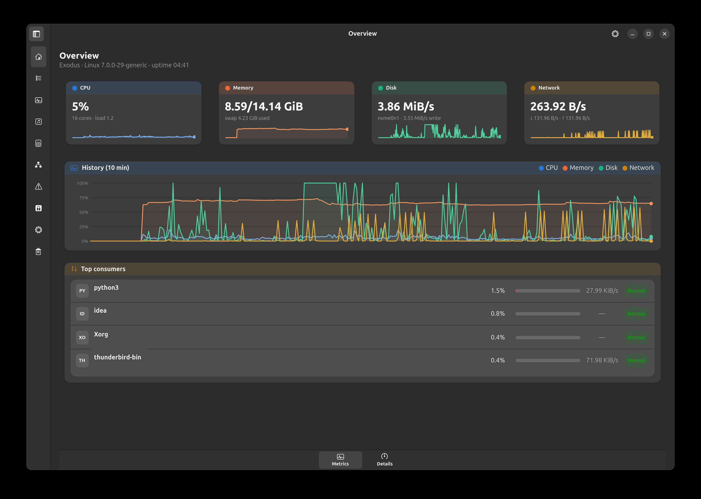

## What it does

System Analyzer is organized as a sidebar of pages, grouped by purpose:

### System

- **Overview** — at-a-glance stat tiles for CPU/Memory/Disk/Network, a
  combined 10-minute history chart, Pressure Stall Information (PSI, how
  often at least one task is stalled waiting on a resource — not raw
  utilization), whole-system power draw via RAPL, per-component
  temperatures (CPU/GPU/disk, matched against their model names, plus
  any ACPI thermal zone the firmware exposes), and the top CPU
  consumers.
- **Processes** — a sortable, filterable process table with four scopes
  (All / User / System / Applications, the last one grouping multi-process
  apps like a browser's tabs into one row). Right-click a process for
  Diagnostics, killing it (with confirmation), opening its executable's
  folder, or copying its PID/name/path.

  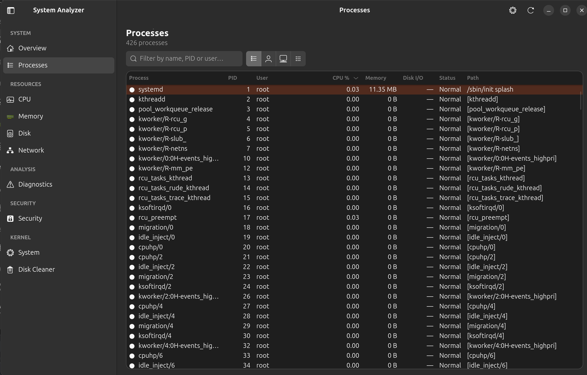

### Resources

Each of CPU, Memory, **Disk** and **Network** gets its own deep-dive page,
organized into tabs — an **Overview** tab shared by all four (a
multi-series history chart — memory tracks every pool: in use, page
cache, buffers, available, swap; disk and network track read/write or
up/down separately — capacity/breakdown, top consumers for that specific
resource, and an automatic-analysis card that calls out a specific
anomaly when it finds one, e.g. "Core 3 is saturated while others stay
idle" or "swap is 25% full even though RAM is still available", instead
of a generic summary), plus tabs specific to each resource:

- **CPU** — Details (scheduler pressure, per-core frequency/thermal),
  Identity (vendor/model, topology, instruction sets, cache), Hardware
  counters (cache misses, IPC, branch mispredictions via `perf`,
  on-demand), Benchmark (single/multi-core throughput, core-to-core
  latency).

  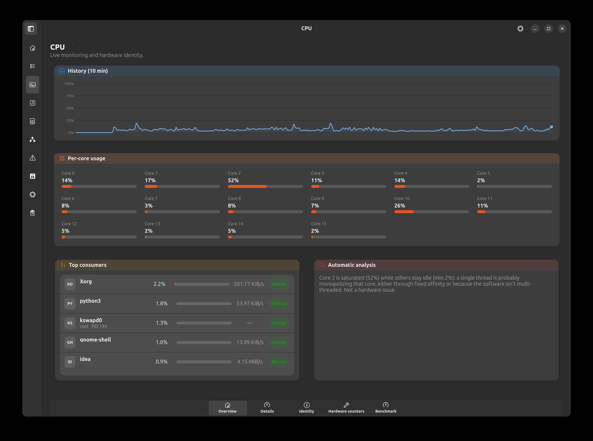

- **Memory** — Diagnostics (RAM module/SPD info, MCE/RAS hardware error
  log, kernel memory breakdown — fragmentation, overcommit, NUMA),
  Benchmark (bandwidth and pointer-chasing latency).

  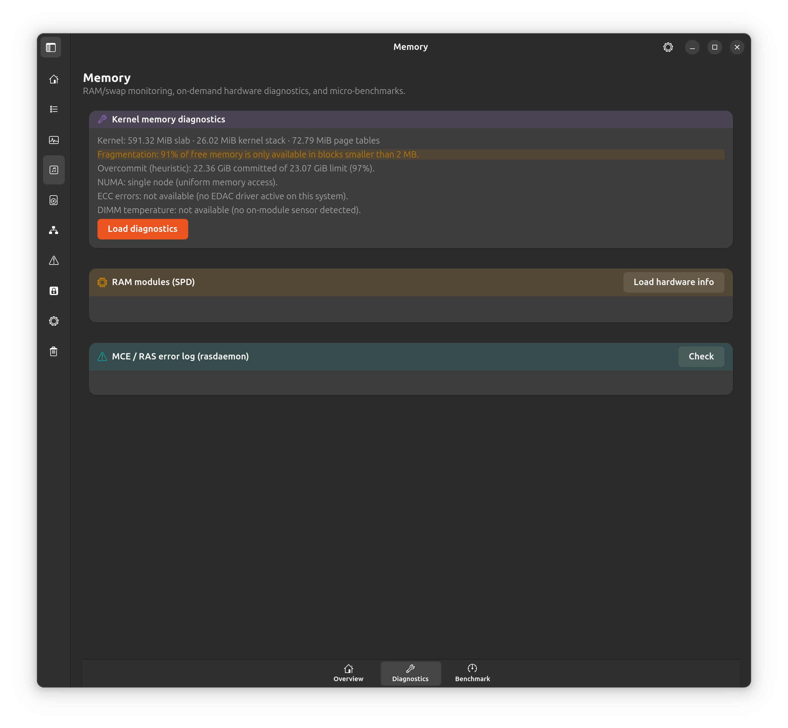

- **Disk** — Details (buffer cache hit rate, dirty-page write-back,
  on-demand fragmentation check), Identity (drive model/serial/firmware,
  partitions, encryption, TRIM support, 4K alignment), Advanced (I/O
  scheduler, PCIe link, and — only when actually in use — Device-Mapper/
  LVM, software RAID, Btrfs scrub), Health (S.M.A.R.T. status,
  temperature, endurance, self-test), Benchmark (sequential, random-4K,
  and concurrent I/O).

  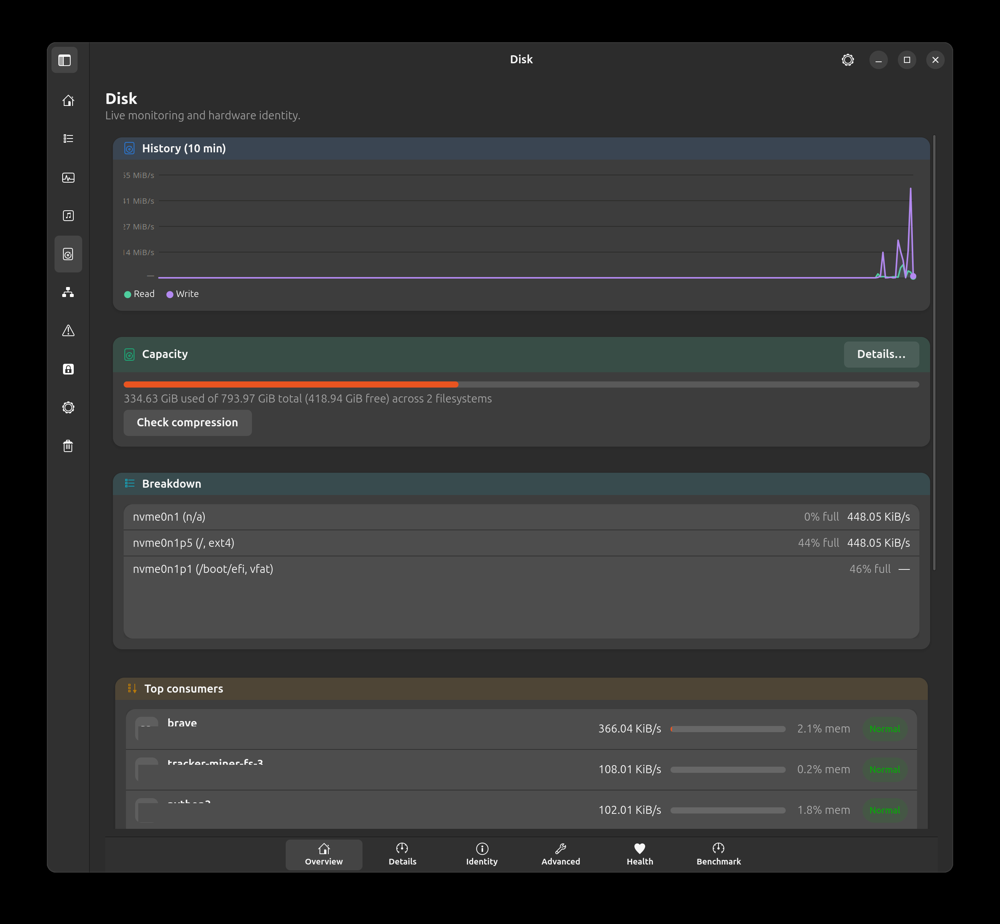

- **Network** — Identity (driver/bus/firmware, MAC address and
  spoofing detection, checksum/segmentation offload, Energy Efficient
  Ethernet), Details (packet/error/collision counters, hardware ring
  buffer), IP & Routing (addresses, routes, DNS, DHCP lease, TCP
  congestion control), Advanced (only when actually in use: SR-IOV,
  hardware queues, XDP, bonding, bridges, VLANs).

  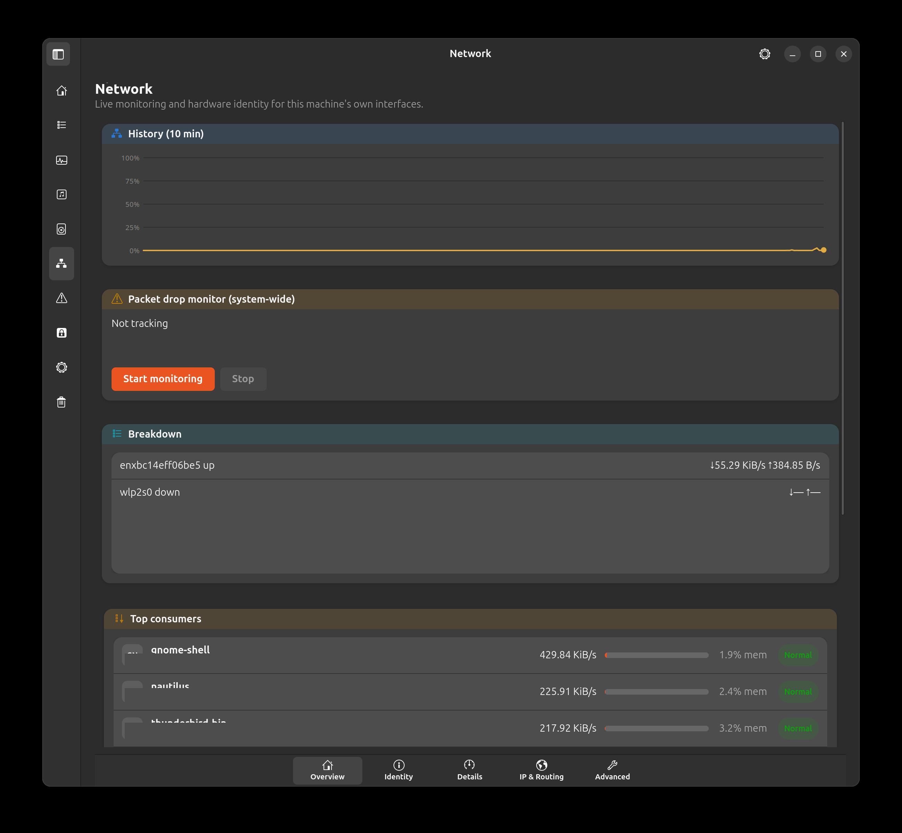

Disk's Overview also has a global capacity dial across every mounted
filesystem, each showing its filesystem type and an inode-usage warning
when a filesystem is close to running out of inodes (a "No space left on
device" that free bytes alone won't explain).

Capacity's **Details…** button opens a full space-usage breakdown with
four tabs: Heaviest folders, Heaviest files, **By type** (space grouped
into Video/Images/Documents/Audio/Archives/Code/Other), and a navigable
**Map** — a radial (sunburst) chart of a folder tree up to 7 levels
deep, next to a matching indented list, with search, sort and
expand/collapse controls. Click a segment (or a row) to zoom into it,
click the center to go back up; each folder's own progress bar is
scaled to its direct parent, so "this is basically all of its parent's
content" is visible at a glance at any depth. Already-visited folders
stay instant to revisit — nothing gets rescanned within the same
session. A checkbox on each row lets you select files/folders and move
them to Trash — restricted to paths strictly inside your home
directory, never anything outside it.

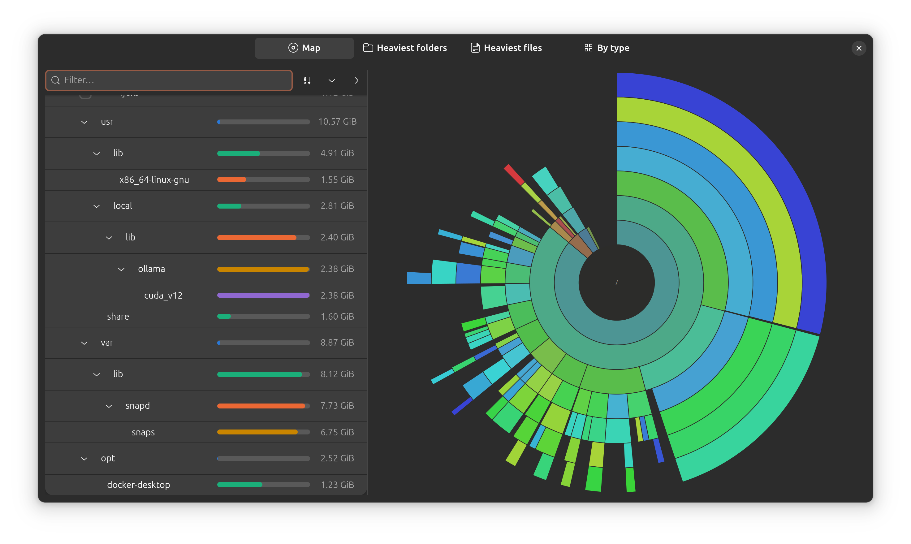

Memory's **Breakdown** card has its own **Details…** button, opening a
**Memory by process** view: the same idea as the Disk Map above but for
the live process tree (grouped by parent/child), sized by cumulative RSS
including every descendant. It never ticks live — only the initial open
and a manual Refresh re-read the process list, so browsing it doesn't
itself show up as activity.

Network's Details tab also has a system-wide packet drop monitor (kernel
drop reasons, not just totals).

### Analysis — Diagnostics

Select any process (from Processes, from a "top consumers" list, or from
the per-process power table) and it opens in its own tab here — open as
many as you like, each tab keeps its own tracking sessions independently,
split into two sub-tabs:

- **Overview** — process identity; an automatic diagnosis of **why it's
  consuming resources** (CPU, memory/OOM score, I/O, network sockets,
  correlated kernel-log lines, and systemd unit status, each finding
  rated good/warning/critical); and **suggested actions** (renice,
  terminate, lower I/O priority, restart the owning systemd unit, and
  more) — every action routes through the same confirm-before-run dialog
  as everywhere else in the app, nothing here runs on its own.
- **Metrics** — the tracking cards below. Every card is opt-in: nothing
  traces anything until you click **Start tracking**, and every
  eBPF-backed card requires a one-time graphical authentication (see
  [Privilege model](#privilege-model) below).

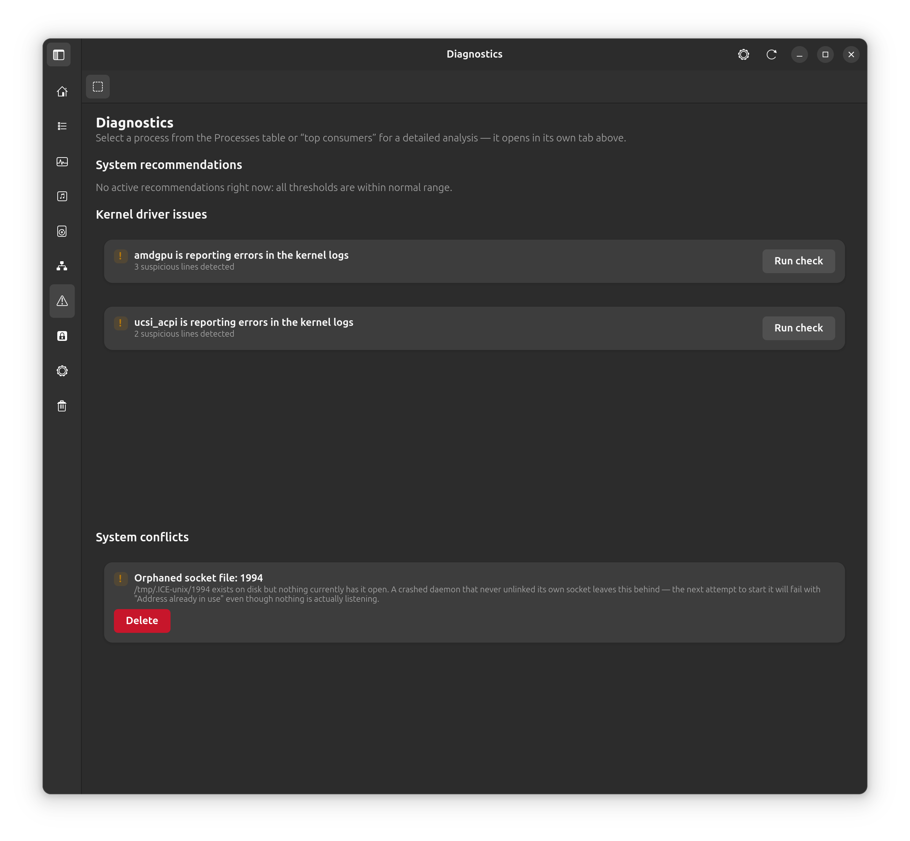

- **Memory leak tracking** — outstanding heap allocations never freed,
  tracked over time via uprobe/uretprobe on malloc/free.
- **I/O activity tracking** — read/write latency and the top files by
  volume.
- **Scheduling latency** — average run-queue wait time.
- **Lock contention** — `pthread_mutex_lock` wait time.
- **TCP handshake latency**.
- **CPU flame graph** — live sampled stack traces, rendered as an icicle
  graph.
- **Syscall anomaly profile** — learns a per-process baseline, then flags
  syscalls that fall outside it.
- **Ransomware behavior canary** — flags a process writing to an unusually
  high number of distinct files per second (the textbook local-encryption
  signature). Observational only: it never freezes a process
  automatically — a manual "Freeze (SIGSTOP)" / "Resume" action is offered
  instead, gated behind the same confirm-before-run dialog as every other
  action in the app.
- **Power draw (RAPL estimate)** — this process' proportional share of the
  whole CPU package's power draw.

A system-wide variant of the power draw and the ransomware canary also
exist (Overview page and Security page respectively) for when you don't
already know which process to suspect.

A pinned, non-closable **Recommendations** tab covers everything that
isn't specific to one process:

- **System recommendations** — step-by-step playbooks (the exact shell
  commands to run, shown to you, not just advice) triggered by real
  conditions: swap running out (**creating** a new swapfile vs.
  **increasing** an existing one, depending on what's already there), a
  filesystem running low on space, and CPU load spread thin enough
  across processes to suggest a governor change.
- **Kernel driver issues** — one card per driver or subsystem currently
  logging errors, resets, timeouts, or a port/lock conflict
  (`EADDRINUSE`, `EEXIST`) in the kernel log, grouped so one misbehaving
  device shows up as a single clear card instead of a wall of raw
  `dmesg` noise — worst offenders first, capped at five. Read-only.
- **System conflicts** — stale PID lock files and orphaned Unix-domain
  socket files (the kind a crashed daemon leaves behind, causing the
  next start attempt to fail with "Address already in use" even though
  nothing is actually listening), plus a finding for the same binary
  running under two different users at once (could be an intentional
  system-wide + per-user setup, or a stray duplicate). File-based
  findings get a **Delete** button that re-checks the file is still
  genuinely orphaned right before removing it, asking for authorization
  first if the file isn't yours — never anything resembling an automatic
  kill/restart/freeze of a live process.

### Security

Organized into Status, Monitoring and Tools tabs.

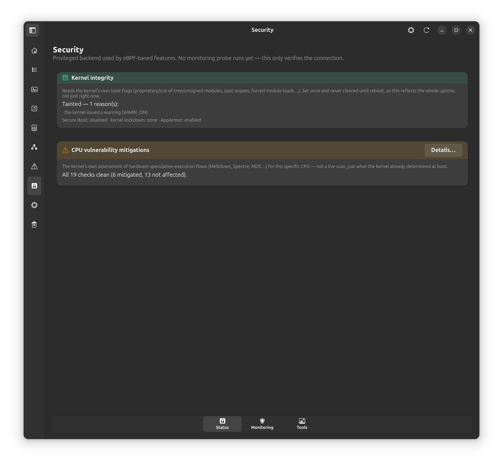

- **Kernel integrity** — the kernel's own taint flags, Secure Boot state,
  kernel lockdown mode, and AppArmor status.
- **CPU vulnerability mitigations** — the kernel's own assessment of
  speculative-execution flaws (Meltdown, Spectre, MDS…) for this specific
  CPU.
- **Metadata cleaner** — strips EXIF (GPS location, camera make/model,
  timestamps) from a photo before you share it; writes a new file, never
  touches the original.
- System-wide ransomware canary (same manual-action safety model as the
  per-process one above).
- A backend connectivity self-test is available but hidden by default
  (Settings → Advanced) — it launches the same privileged worker the
  eBPF cards use, just to prove the pipe works; no tracking probe
  actually depends on it yet.

### Kernel

Split into two sub-tabs, Kernel and System.

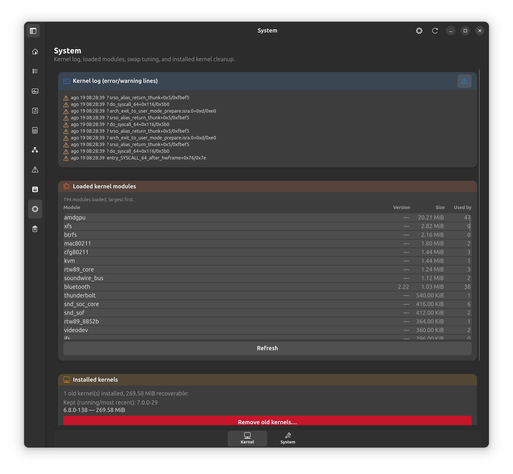

- **System** — kernel log (dmesg), loaded kernel modules (name, version,
  size, reference count — click one for its `modinfo` detail: description,
  author, license, dependencies), swappiness tuning (`vm.swappiness`),
  kernel package cleanup (never touches the running kernel or
  the single newest one), sandboxed app inventory (Flatpak/Snap/Docker), a
  suspend/resume report (recent sleep-cycle history from the kernel log,
  and which devices are currently allowed to wake the machine), and a
  **Boot analysis** card (`systemd-analyze` blame/critical-chain in a
  resizable split view, plus a Suggestions section that turns that data
  into plain-language recommendations — slow firmware/bootloader time,
  known slow-unit patterns, excessive Snap loop mounts — instead of
  leaving it for you to interpret unaided).
- **Disk Cleaner** — six tabs, grouped by permission tier and purpose.
  **Nothing is ever deleted silently**: every action shows the literal
  shell command it's about to run in a confirmation dialog first, and
  every scan tool can **export its results to JSON/CSV**.
  - **Basic** — user-level caches needing no admin rights (thumbnail
    cache, pip, npm, browser cache, Trash including external drives,
    unused Flatpak runtimes) and system-level caches that do (APT
    archive + list cache, orphaned packages/autoremove, systemd journal,
    crash dumps from apport/systemd-coredump), scanned and cleaned
    separately.
  - **Snap** — every installed snap in one scrollable, size-sorted list.
    Old/disabled revisions kept for rollback are highlighted and, along
    with any snap you likely installed yourself (checked against snapd's
    own local API, not a static list), can be removed individually or in
    bulk. A base/runtime snap other snaps depend on (`core*`, `bare`,
    `snapd` itself, a content snap with no commands of its own) is shown
    but never offered for removal.
  - **Filesystem** — empty folders and broken symlinks (found under a
    folder you pick, then removed); duplicate files, **hardlinked** to
    their first copy instead of deleted (nothing lost, nothing
    pre-selected — review each pair yourself); a **file timeline**
    (Modify/Access/Change times); an opt-in **live folder-growth watch**
    (flags a burst of many files changing in one folder within a few
    seconds — no root needed, no recursion into subfolders).
  - **Logs & Temp** — a custom journal size/age threshold beyond the
    Basic tab's fixed 100 MB, and stale `/tmp`/`/var/tmp` entries (never
    runs as root, so it can only remove files you already own).
  - **User Data** — orphaned thumbnails (the source picture no longer
    exists at the path recorded inside them), unused-language files
    (every locale actually in use is always kept), and possibly-orphaned
    app data under `~/.config`/`~/.local/share` (a heuristic — nothing
    is pre-selected, check each one yourself).
  - **Security** — unused Docker/Podman items (dangling images, exited
    containers, dangling volumes — never a blanket prune); on-demand
    **TRIM** (SSD/NVMe discard) and **Btrfs balance/scrub** maintenance,
    each hidden automatically when it doesn't apply to your disk; **secure
    delete (shred)**, overwriting a file's contents before removing it,
    with a warning shown when the disk might be an SSD or the filesystem
    is copy-on-write (btrfs/ZFS) — both cases where an overwrite doesn't
    reliably erase the original data.

  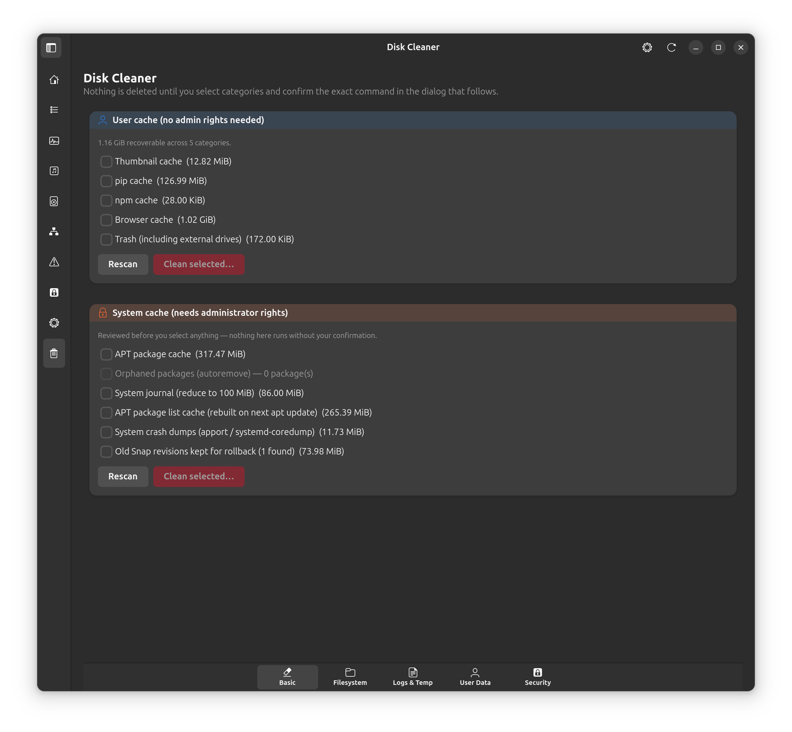

### Settings

A toggle per sidebar page lets you hide sections you don't use — nothing
is lost when you do (a hidden page's state, including any running
tracking session, is preserved if you turn it back on). A **Metrics**
panel lets you export Diagnostics tracking data to Prometheus via the
textfile-collector convention (writing one `.prom` file per active
tracking session to a directory node_exporter watches) — off by default,
with a master switch, a switch per tracking card, and a configurable
output directory/interval. It never opens a network listener of its own;
node_exporter still does the scraping. Includes an About panel with
version info and an update check against this repository's releases.

## Privilege model

The GTK UI **never runs as root** — the executable itself refuses to start
if launched with `sudo`. eBPF-based tracing features (everything under
Diagnostics, the system-wide canary, the packet drop monitor, RAPL power
reading) spawn a separate, minimal privileged worker process on demand via
`pkexec`, communicating with the UI over a local Unix Domain Socket. A
graphical authentication prompt appears only the first time you click
**Start tracking** on one of those specific cards — the rest of the
application, including all four resource pages, the process table, and
the disk cleaner's *scan*, needs no elevated privileges at all.

## Installation

Download the `.deb` from the [latest release](../../releases/latest), then:

```sh
sudo apt install ./system-analyzer_<version>_all.deb
```

`apt` resolves all dependencies automatically. Requires **Ubuntu 24.04
(Noble) or newer** — GTK 4.10+ and libadwaita 1.5+ are needed and are too
old on Ubuntu 22.04's repositories.

### Dependencies

Installed automatically as hard requirements: `python3-gi`,
`gir1.2-gtk-4.0`, `gir1.2-adw-1`, `python3-psutil`, `python3-pil`,
`policykit-1` (provides `pkexec`), `libglib2.0-bin` (provides `gio`, used
for emptying Trash).

Installed by default as recommendations (skip with
`--no-install-recommends` if you don't want them): `python3-bpfcc` +
`bpfcc-tools` for the eBPF tracing features, `network-manager` for
network discovery/DHCP/DNS lookups on the Network page, `btrfs-progs`
for the Disk/Disk Cleaner Btrfs cards, `ieee-data` for MAC-vendor
lookups, `dmidecode` for the Memory page's RAM module (SPD) card,
`rasdaemon` for the MCE/RAS hardware error log, `linux-tools-generic`
for the CPU page's perf-based hardware counters, `smartmontools` for
the Disk page's S.M.A.R.T. Health tab, `nvme-cli` for the optional NVMe
telemetry export, and `lvm2` for the Device-Mapper/LVM card. **The app
is fully usable without any of these** — each specific card that needs
one shows a clear "not available"/install message instead of silently
failing or crashing. One exception worth knowing about: `smartmontools`
ships its own always-on background service (`smartd`, unrelated to this
app — it isn't used here, the Health tab talks to the drive directly);
this package's installer disables that service right after install,
since it would otherwise run indefinitely for no reason this app needs.

### Known limitation: very recent kernels

On kernel **7.x** (currently only reachable via Ubuntu 24.04's HWE
enablement stack, not the default GA kernel), three eBPF-based cards —
**I/O activity tracking**, **CPU flame graph**, and the **ransomware
canary** (both the per-process and system-wide variants) — disable
themselves automatically with an explanation instead of failing at
runtime. The Ubuntu-packaged BCC version this app builds against hasn't
caught up with that kernel's header layout yet; upstream BCC only added
kernel 7.x support in a release newer than what any Ubuntu repo
currently ships. Every other feature, including the rest of Diagnostics,
is unaffected.

### Uninstall

```sh
sudo apt remove system-analyzer
```

## Third-party

System Analyzer doesn't bundle any third-party library — everything below
is either dynamically linked against the system's own copy (installed
separately via `apt`, declared as a package dependency) or invoked as a
standalone external command. Neither case imposes any license obligation
on this project's own code; listed here for transparency about what runs
underneath it.

| Component | License | How it's used |
|---|---|---|
| GTK4 | LGPL-2.1-or-later | Dynamically linked (system library) |
| libadwaita | LGPL-2.1-or-later | Dynamically linked (system library) |
| PyGObject | LGPL-2.1-or-later | Dynamically linked (system library) |
| psutil | BSD-3-Clause | Python dependency |
| Pillow | HPND (MIT-like) | Python dependency, metadata cleaner |
| BCC (BPF Compiler Collection) | Apache-2.0 | Compiles the eBPF probes at runtime |
| polkit (`pkexec`) | LGPL-2.1-or-later | Invoked as an external process |
| NetworkManager (`nmcli`) | GPL-2.0-or-later | Invoked as an external process |
| btrfs-progs | GPL-2.0-or-later | Invoked as an external process |
| GLib (`gio`) | LGPL-2.1-or-later | Invoked as an external process |
| iproute2 (`ip`, `ss`, `bridge`) | GPL-2.0-only | Invoked as an external process |
| ethtool | GPL-2.0-only | Invoked as an external process |
| dmidecode | GPL-2.0-or-later | Invoked as an external process |
| rasdaemon | GPL-2.0-or-later | Invoked as an external process |
| smartmontools | GPL-2.0-or-later | Invoked as an external process |
| nvme-cli | GPL-2.0-or-later | Invoked as an external process |
| LVM2 | GPL-2.0-or-later | Invoked as an external process |
| perf (linux-tools) | GPL-2.0-only | Invoked as an external process |

## License

The compiled `.deb` package distributed here is free to use and
redistribute unmodified — see [LICENSE](LICENSE) for the exact terms.
The source code is not published in this repository.
